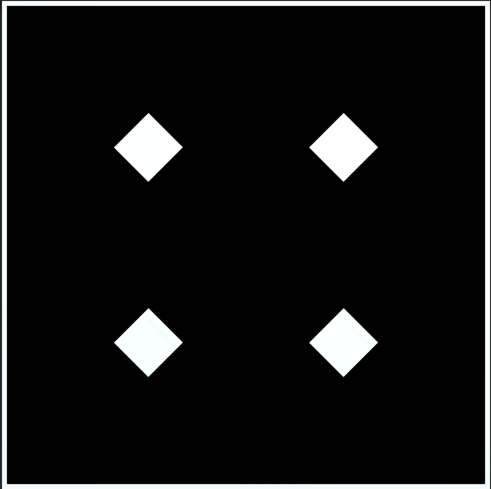

# Pink Diamonds! | Documentation!
***Shine bright like a diamond. Shine on you crazy diamond, etc etc***

## It Begins Anew | 23.11.22

###  A Continuation of Sorts

One main goal of this project is to explore using Niall Moody's [LibPDIntegration](https://github.com/LibPdIntegration/LibPdIntegration), 
and after discovering Yann Seznek's recent awesome [granular exploration system](https://github.com/yannseznec/ys.granular) an idea presents itself:
Building on the voice-tuning minigame in [TIKATMOS](https://github.com/mouseandthebillionaire/tikatmos), manipulate a number of parameters of an audio file to be able to hear it properly.

<video src="https://user-images.githubusercontent.com/8988958/204880088-65176b04-083e-4871-832f-c0f9a7d6a45e.mov" controls="controls"></video>

### Concepts
* This version has the 4 diamonds[1](https://github.com/mouseandthebillionaire/pinkDiamonds/tree/main/Process#1-which-yeah-arent-pink-like-theyre-supposed-to-be-currently-but-who-was-time-to-create-pink-textures-for-3d-objects-just-to-be-cute) that each control one parameter on their x and y axis
* These parameters are mapped from 0-1 in Pd, so it makes it really easy to convert the square space of -5 to 5
* The parameters used are grain pitch, random offset, random pitch, grain density, grain size, and autoplay speed.
* Two of the diamonds have the same parameter for their x and y axis, meaning that the ideal state is either lower left or upper right 
* As you move the diamonds[2](#####2) around the sound becomes slightly more clear? Which is the point?

### Thoughts and Future Possibilities

* As mentioned, the parameters are from 0-1 so the extreme positions are generally "proper." 
  A more interesting version of this would be where each diamond has a starting location, and an ideal location it would like to be in (though this might make finding that location much harder?)
* Yann has built the granular patch so that any number of systems can be going at the same time. 
  Would it be fun/interesting to have multiple tracks of a song/performance/etc that you need to line up? Each track could be a different color of diamond
* Another possibility here is "code-breaking." The player has to tune into the voice reciting a code and enter that into the game somewhere[3](#####2)
* Instead of arbitrary 3D space, this could also be implemented as a 2D interactive interface where you have to tweak knobs to get the sound dialed in (like some sort of soviet-era control room)[4](#####4)

### Notes

##### 1 Which, yeah, aren't pink like they're supposed to be currently, but who was time to create pink textures for 3D objects just to be cute?
##### 2 Easter Egg: if you end up bumping one diamond into another they'll start spinning and moving around the space because the physics system is still on, and it's pretty funny. Probably room here for more exploration into this idea. Like if the controls actually looked like knobs and dials and stuff but then just went flying around in the space as you were trying to tweak their settings? Haha. Definitely.
##### 3 Almost like an audio version of Nicole He's [enhance.computer](https://www.enhance.computer/)
##### 4 Though this would be highly similar to Samantha Kalman's [Echoic Memory](https://play.date/games/echoic-memory/) for the Playdate

## Interaction Ideas ##
"Let's not make this too gamelike, it's meant to be experimental. Nope, not a puzzle either. Just explore sound and object positioning and... you know... like... moving diamonds around... and..."

### GAME Ideas!

All of these ideas seem immediately A+, but the spinning combination lock may be the most promising?
Additionally, the possibility for puzzly gamey things is strong here. So, to implement:
* 6 pinning concentric circles attached to the 6 paramters implemented in the first prototype
* A voice that is reading a code? And the user can enter the code (i.e the audio version of Nicole He's [enhance.computer](https://www.enhance.computer/) mentioned above)
* Might be good to eventually add other effects that obfuscate the voice (distortion, filters) but for now focusing on the granular synthesis alone is fine

Onward!