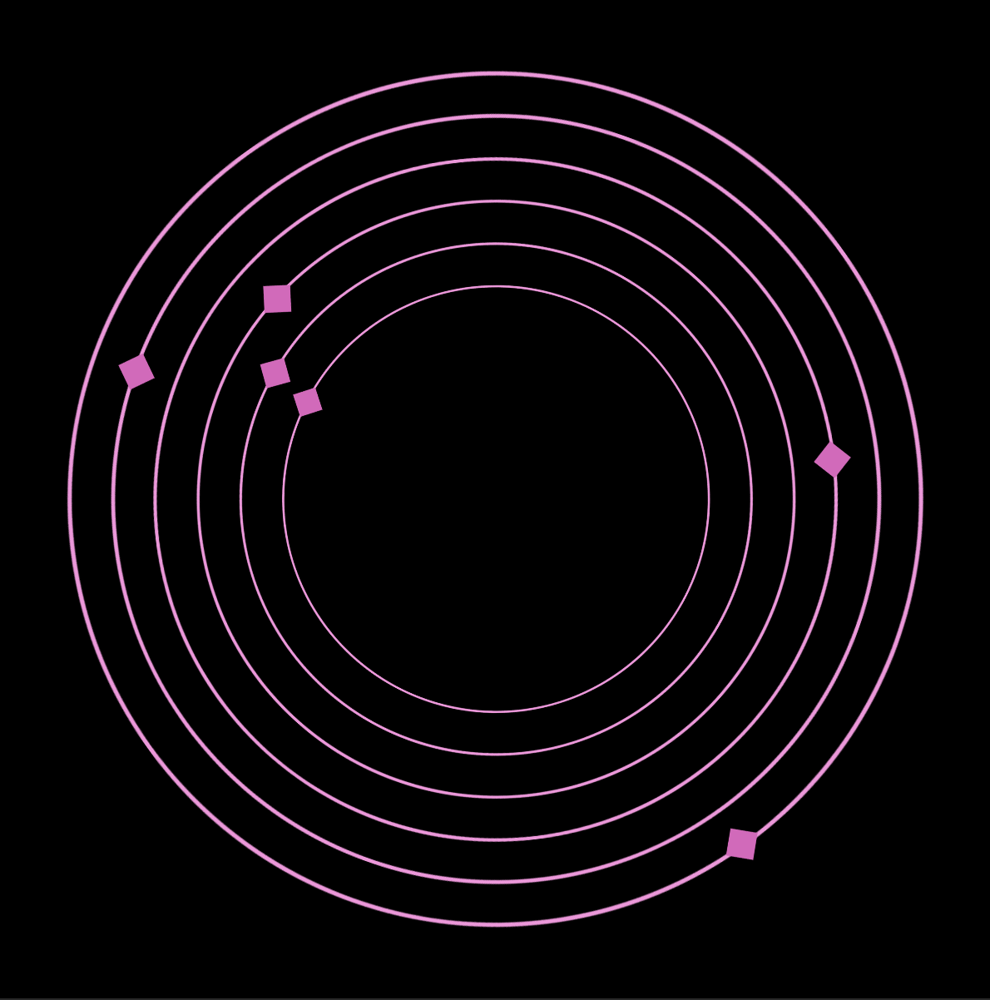

# Pink Diamonds! | Documentation!
***Shine bright like a diamond. Shine on you crazy diamond, etc etc***

## It Begins Anew | 23.11.22

###  A Continuation of Sorts

One main goal of this project is to explore using Niall Moody's [LibPDIntegration](https://github.com/LibPdIntegration/LibPdIntegration), 
and after discovering Yann Seznek's recent awesome [granular exploration system](https://github.com/yannseznec/ys.granular) an idea presents itself:
Building on the voice-tuning minigame in [TIKATMOS](https://github.com/mouseandthebillionaire/tikatmos), manipulate a number of parameters of an audio file to be able to hear it properly.

<video src="https://user-images.githubusercontent.com/8988958/204880088-65176b04-083e-4871-832f-c0f9a7d6a45e.mov" controls="controls"></video>

### Concepts
* This version has the 4 diamonds[1](https://github.com/mouseandthebillionaire/pinkDiamonds/tree/main/Process#1-which-yeah-arent-pink-like-theyre-supposed-to-be-currently-but-who-was-time-to-create-pink-textures-for-3d-objects-just-to-be-cute) that each control one parameter on their x and y axis
* These parameters are mapped from 0-1 in Pd, so it makes it really easy to convert the square space of -5 to 5
* The parameters used are grain pitch, random offset, random pitch, grain density, grain size, and autoplay speed.
* Two of the diamonds have the same parameter for their x and y axis, meaning that the ideal state is either lower left or upper right 
* As you move the diamonds[2](#####2) around the sound becomes slightly more clear? Which is the point?

### Thoughts and Future Possibilities

* As mentioned, the parameters are from 0-1 so the extreme positions are generally "proper." 
  A more interesting version of this would be where each diamond has a starting location, and an ideal location it would like to be in (though this might make finding that location much harder?)
* Yann has built the granular patch so that any number of systems can be going at the same time. 
  Would it be fun/interesting to have multiple tracks of a song/performance/etc that you need to line up? Each track could be a different color of diamond
* Another possibility here is "code-breaking." The player has to tune into the voice reciting a code and enter that into the game somewhere[3](#####2)
* Instead of arbitrary 3D space, this could also be implemented as a 2D interactive interface where you have to tweak knobs to get the sound dialed in (like some sort of soviet-era control room)[4](#####4)

### Notes

##### 1 Which, yeah, aren't pink like they're supposed to be currently, but who was time to create pink textures for 3D objects just to be cute?
##### 2 Easter Egg: if you end up bumping one diamond into another they'll start spinning and moving around the space because the physics system is still on, and it's pretty funny. Probably room here for more exploration into this idea. Like if the controls actually looked like knobs and dials and stuff but then just went flying around in the space as you were trying to tweak their settings? Haha. Definitely.
##### 3 Almost like an audio version of Nicole He's [enhance.computer](https://www.enhance.computer/)
##### 4 Though this would be highly similar to Samantha Kalman's [Echoic Memory](https://play.date/games/echoic-memory/) for the Playdate

## Interaction Ideas 30.11.22 ##
"Let's not make this too gamelike, it's meant to be experimental. Nope, not a puzzle either. Just explore sound and object positioning and... you know... like... moving diamonds around... and..."

### GAME Ideas!

All of these ideas seem immediately A+, but the spinning combination lock may be the most promising?
Additionally, the possibility for puzzly gamey things is strong here. So, to implement:
* 6 pinning concentric circles attached to the 6 paramters implemented in the first prototype
* A voice that is reading a code? And the user can enter the code (i.e the audio version of Nicole He's [enhance.computer](https://www.enhance.computer/) mentioned above)
* Might be good to eventually add other effects that obfuscate the voice (distortion, filters) but for now focusing on the granular synthesis alone is fine

Onward!

## Combination-Lock Style Interface ##
This version trades the four white diamonds in for concentric circles.[5](#####5)

This seems _fine_ but the way that the granular synthesizer is being implemented is far from ideal. Some tweaking needs to happen to the underlying Pd patch to make the extremes of each effect feel better. 
Right now the distances between total chaos and being overly sparse for some of the effects is far too large.
Also maybe increasing the number of obvious inputs (even though they actually remain the same number of parameters) is too complicated?

<video src="https://user-images.githubusercontent.com/8988958/206069982-b2ae172a-072d-4a11-9e93-be984b876b50.mov" controls="controls"></video>

Unfortunately, something is terribly wrong here and the Pd audio doesn't run in the desktop build of this, only in the Unity editor, which is just _infuriating_. Additionally, it is beginning to feel that perhaps the granular synthesizer is not the solution here? This could probably be faked (adding distortion and/or sound-designy flourishes) to greater effect in a puzzly situation like this. Or maybe not! Don't give up heart! There's still space to explore these implementations!

But for now at least, for this final stage, let's take step back and make something more _sonically_ interesting. 
The circles will remain, but will be instead be a series of multiple (3?) concentric circles of different colors that each control the granular synthesis applied to different instruments. It's an experiment!

### Notes

##### 5 With PINK diamonds. So there's that!

 
## Music Manipulation ##

Okay. So here is the final (for now) iteration of this exploration.
In this version two sounds are loaded (and arpegiated pad and a lead playing a simple descending melody)
The two dial groups are then each assigned a sound to manipulate granularly. The effect manipulations are as follows (from the outside-in)

* Width of random offset locations
* Direct control of center of random offset
* 100% chance that a grain will be played
* Density of grains
* Size of grains
* Speed of autoplay

It's not terrible! But it's not great. Some things that would probably help (or at least not hurt)
* Tweaking the variables so they produce for obvious changes. There's a lot of nuance here, and that makes it pretty hard to read
* Adding other sonic manipulation _in addition_ to what's here. So you tweak the know for grain size, and that changes but you also hear reduced distortion of a continuous tone
* In a true UX-guided world it would obviously make sense to add labels, instructions, etc, but that defeats the purpose, so...

And that's it for now! There's definitely something here, and it's far from perfect, but exploration achieved! Things were learned!